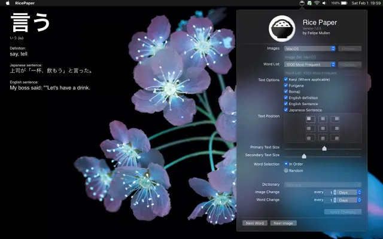

# RicePaper



Interactive wallpaper scheduler and Word-of-The-Day assistant for japanese language learning.

### What is it?

Rice Paper is a productivity tool to help you learn Japanese vocabulary by incorporating new words into your desktop wallpaper. With Rice Paper, you can choose a list of words and see your desktop update and rotate through images with ease!

### [UPDATE] January 2023

> The original code is now open source.

### [UPDATE] January 2021

> I have made the Rice Paper App a Free App on the App Store for a limited time. If you like the App or find it useful somehow, please consider rating it, sharing it with a fellow Japanese learner, or if you feel generous, even buying me a cup of coffee ☕️ https://www.paypal.me/felipemullen

## Helpful Links

- [Bug Reporting](/docs/bug-reporting.md)
- [Changelog](/docs/changelog.md)
- [FAQ](/docs/faq.md)
- [Privacy Policy](/docs/privacy.md)

### Features

- Choose predetermined image sets or your own folder of images
- Choose [custom word lists](#Custom-Lists)
- Set image rotation schedule
- Set word rotation schedule
- Choose words at random or move through the list in order
- Change the positioning of the text on your desktop
- Include example sentences in Japanese and English
- Show furigana / romaji readings for kanji

### Word Lists

- Top 100 most frequent Japanese words
- Top 1000 most frequent Japanese words
- NLPT-5 Level Words
- NLPT-4 Level Words
- NLPT-3 Level Words
- NLPT-2 Level Words
- NLPT-1 Level Words
- Heisig RTK Words
- 6000 Most important words to know
- Choose [your own list](#Custom-Lists) of words

### Custom Lists

> Using a custom list is easy. Simply create a text file with one word per line, and load it into Rice Paper.

For example, let's say I wanted to rotate through the numbers 1 to 10. I would create a file called `Numbers.txt` and paste the following content:

```
一
二
三
四
五
六
七
八
九
十
```

Then all I have to do is open up Rice Paper and load `Numbers.txt` as a custom word list! 👏